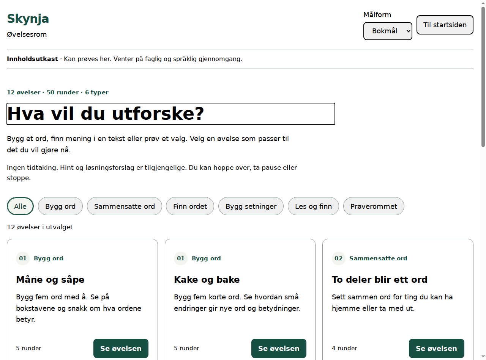
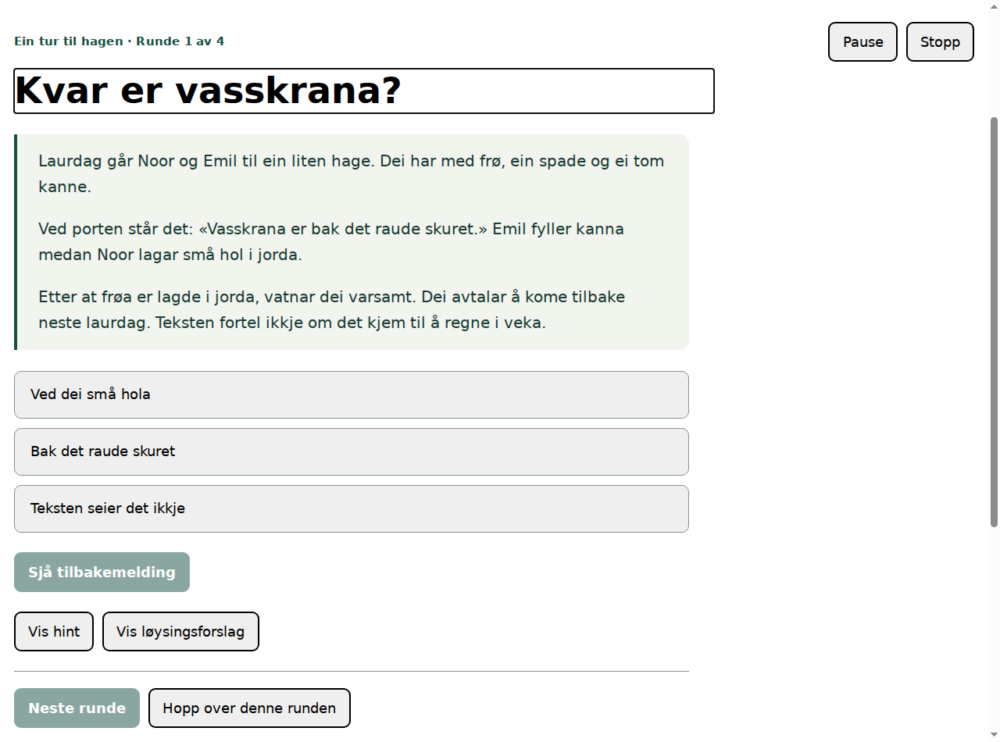

# Skynja – utvidet øvelsesrom

23. september 2026. Lokal leveranse på `content/exercise-room`, basert på kanonintegrasjonen i `85ac22f`.

> Denne rapporten beskriver leveransen ved `458b2cc`. Se [Finn tekstbeviset](SKYNJA_TEXT_EVIDENCE_2026-09-23.md) for videreføringen til 13 øvelser og 56 runder.

## Hva som er lagt inn

Appens startside har knappen **Åpne øvelsesrom** / **Opne øvingsrom**. Den åpner 12 interaktive øvelser med 50 runder. Hver runde er skrevet på både bokmål og nynorsk: 50 semantiske oppgaver, 100 språkrealiserte runder.

| Type | Øvelser | Runder | Handling |
|---|---|---:|---|
| Bygg ord | Måne og såpe; Kake og bake | 10 | Velg bokstavbrikker i rekkefølge med et synlig modellord |
| Sammensatte ord | To deler blir ett ord; Ord på vei | 8 | Sett sammen to orddeler ut fra betydningen |
| Finn ordet | Finn ordet som passer; Ord som binder sammen | 8 | Bruk kontekst, tidsrekkefølge, årsak og motsetning |
| Bygg setninger | Hvem gjør hva?; Små beskjeder | 8 | Sett ordbrikker sammen til setninger og støttebeskjeder |
| Les og finn | En tur til hagen; Les en praktisk beskjed | 8 | Finn detaljer, trekk begrunnede slutninger og identifiser manglende informasjon |
| Prøverommet | Velg støtte; Finn en vei videre | 8 | Vurder situasjoner med flere forsvarlige valg og rom for usikkerhet |
| **Sum** | **12 øvelser** | **50** | **Seks typer** |

«Måne og såpe» og «Kake og bake» bygger videre på de to tidligere innholdsutkastene. De har nå fem interaktive ordrunder hver i øvelsesrommet. Det historiske forfatterverktøyets ti pakker og elevkatalogens åtte aktiviteter beholder egne kontrakter. Øvelsesrommet er en ny, tydelig merket utkastvisning; det oppgraderer ikke eldre innhold til godkjent læringsinnhold.



## Innhold og støtte

Alle øvelser har formål, introduksjon, veiledning for støtteperson og forslag til videre samtale. Hver runde har oppgave, meningsbærende kontekst, hint, løsningsforslag, forklaring og et valgfritt refleksjonsspørsmål. Flervalgsrundene gir en egen begrunnelse for hvert alternativ, også når det ikke passer.

De praktiske tekstene og situasjonene er oppdiktet. Plakaten om sykkelverksted er ikke informasjon om et faktisk arrangement. Prøverommet er øving i vurdering og samtale, ikke individuell faglig rådgivning.

Hint og løsningsforslag er tilgjengelige fra starten. Brukeren kan endre et svar, legge brikker tilbake, hoppe over, pause eller stoppe. Like bokstavbrikker kan brukes om hverandre. Alle handlinger fungerer med vanlige knapper og tastatur; dra-og-slipp er ikke nødvendig.

Oppsummeringen viser hvilke runder som ble undersøkt, hoppet over eller gjennomgått med løsningsforslag, og hvilke tekststøtter som ble åpnet. Den gir ingen global poengsum, nivåplassering eller slutning om selvstendig lesing. Opplesning fra en person kan brukes, men appen registrerer ikke at dette har skjedd. Det finnes ingen innspilt lyd for disse nye rundene.



## Integrasjon og livssyklus

- `src/core/skynja/exercise-room.ts`: felles semantisk modell, fullstendighetskontroll og evaluering av brikkesvar.
- `src/content/skynja/`: eksplisitte BM-/NN-realiseringer for alle tekster, ord, svarvalg og forklaringer. Ingen automatisk oversettelse eller fallback.
- `src/application/skynja/exercise-room-controller.ts`: lokal tilstand for katalog, introduksjon, aktiv øvelse, pause, fullføring og stopp.
- `src/ui/browser/exercise-room-templates.ts` og `app.ts`: katalogfilter, selve oppgavene, støtte, fokus og navigasjon.
- `src/core/skynja/exercise-room-policy.ts`: ruting av en felles restriktiv innholdspolicy til riktig katalog. Ukjente ID-er blir fortsatt avvist av den historiske kontrollen.

Målformen velges før øvelsen og beholdes mens forsøket er aktivt eller pauset. Et språkbytte endrer dermed ikke stimuli eller fasit underveis. Ønsket om å stoppe fjerner valgte svar, støtteflagg og rundeoversikt. Forsinkede svarhandlinger, «fortsett» og «neste» kan ikke gjenåpne et stoppet forsøk. En ny øvelse krever et nytt valg.

Ingen forsøksdata lagres i nettleserlagring eller sendes til en tjeneste. Vanlig omlasting gir et nytt, tomt øvelsesrom. Restriksjoner på innhold lagres gjennom den eksisterende service worker-policyen. Tilbaketrekking av et tidligere innholdsutkast følger med inn i det nye rommet, og sperring av en øvelse avslutter et aktivt eller pauset forsøk. Tommere eller eldre restriksjoner gjenåpner ikke sperret innhold.

Alle nye moduler er med i offline-skallet. Appoppdatering er utsatt mens en øvelse er aktiv eller pauset. En eventuell aktiv historisk økt pauses når øvelsesrommet åpnes.

Kanonregisteret peker nå på delimplementasjoner for SKP-007, 008, 016 og 043 og utvidet språkstøtte for SKP-050. Ingen prinsipper er erklært ferdig implementert.

## Verifikasjon

| Kontroll | Resultat |
|---|---|
| Alle 50 runder i begge målformer | Strukturelt komplette; alle brikkesvar kan bygges med hele brikker |
| Innhold og livssyklus | Tester for blant annet duplikatbokstaver, manglende språkvariant, retry, støtte, pause, stopp og restriksjoner |
| `test:exercises-browser` | Bestått i Chromium 153: alle 12 øvelser besvart på begge målformer; støtte, oppsummering, tastatur, fokus, 320 px, zoom og tilgjengelighetstre |
| Offline i øvelsesrommet | Vanlig offline-omlasting bevarer restriksjoner; nynorsk leseøvelse kan åpnes og besvares |
| PWA-kontrakter | 11 bestått; manglende øvelsesmodul avviser installasjon |
| Kompilerte tester | 333 bestått, 0 feil, inkludert 13 nye øvelses- og policytester |
| Kanon og kildeintegritet | Kontroll og alle fem tester består; originalpakken er uendret |
| `test:authoring-browser` og `test:pwa-browser` | Begge består, inkludert vanlig offline-omlasting, tilbaketrekking og kontrollert oppdatering |
| Installérbar pakke | `INSTALLABLE_ALPHA_OUTPUT_READY` i lokal `deploy/` |
| `npm run check` | Stopper ved eksisterende `PINNED_GIT_WINDOWS_RUNTIME_REQUIRED`; ingen full releasegodkjenning |

Det ble funnet og rettet en reell integrasjonsfeil: den gamle katalogen kjente ikke ID-ene til nye øvelser. Policyen fordeles nå på de to katalogene uten å forkaste ukjente ID-er eller lempe på kontrollene.

En separat nettleserprobe viste at `Page.reload({ ignoreCache: true })` i denne Chromium-versjonen etterlater siden uten kontrollerende service worker, selv om registreringen fortsatt er aktiv. Vanlig omlasting gjenoppretter kontrollen; vanlig offline-omlasting fungerte. Øvelsestesten og forfattertesten bruker derfor vanlig omlasting for å teste PWA-flyten. Dette er ikke et løfte om at tvungen oppfriskning uten nett skal fungere.

`agent-browser`-verktøyets daemon startet ikke i dette miljøet. De faktiske nettleserkontrollene og skjermbildene ble kjørt med prosjektets Chromium/CDP-oppsett, med konsoll- og unntakskontroll. Dette er automatiske, lokale kontroller; fysisk enhet og manuell skjermleser er ikke testet. Den tidligere feilen i forfattertestens vanlige offline-flyt er nå lukket med bestått nettlesertest. Testresultatene og fullkontrollens stoppunkt finnes i `artifacts/skynja-*-browser.log`, `artifacts/skynja-exercises-check.log` og `artifacts/skynja-exercises-verification.json`.

Se [CURRENT_STATUS.md](CURRENT_STATUS.md) for samlet testresultat og Windows-porten i fullkontrollen.

## Hva som gjenstår

Innholdet er `AI_ASSISTED_CONTENT_DRAFT`, `DRAFT_REVIEW_REQUIRED`, `humanReviewed: false`. Faglig, språklig og målgrupperettet menneskelig gjennomgang gjenstår. Ingen godkjenninger, signaturer, effektbevis eller reviewkvitteringer er konstruert.

Dette er lokal kode og et lokalt bygg. Det er ikke utført GitHub-push, merge, deployment eller åpning for ekte pilotdata i denne leveransen. Den tidligere blokkerte GitHub-opplastingen er ikke forsøkt på nytt.

## Lokal kjøring

```bash
npm ci
npm run build
npm run serve:proof
```

Åpne `http://127.0.0.1:4173/web/index.html` på maskinen som kjører serveren, og velg **Åpne øvelsesrom**. Nettlesertesten kjøres med `npm run test:exercises-browser`; den bruker prosjektets eksisterende lokale Chromium-resolver. `node scripts/build-installable-alpha.mjs` pakker et ferdig kompilert bygg i `deploy/` uten å publisere det.
