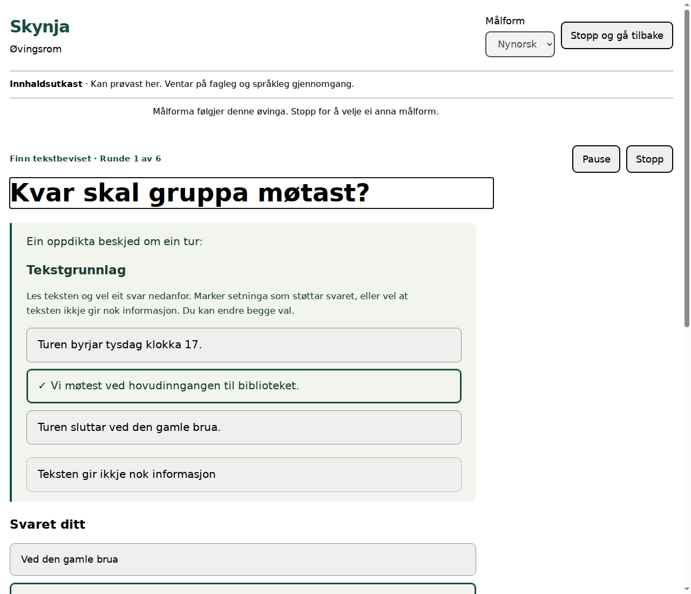

# Skynja – Finn tekstbeviset

23. september 2026. Videreføring av [øvelsesrommet](SKYNJA_EXERCISE_ROOM_2026-09-23.md) på `content/exercise-room`, med `integration/installable-alpha` som målgren for GitHub-integrasjonen.

## Ny handling i øvelsesrommet

**Finn tekstbeviset** lar brukeren velge både et svar og tekststedet som støtter det. Et passende svar alene åpner ikke «Neste runde». Feil svar får sin egen forklaring; et passende svar med feil tekstgrunnlag får beskjed om å undersøke grunnlaget. Begge valg kan endres. Hint, løsningsforslag og hopp over er fortsatt tilgjengelige.

De seks rundene har én felles semantisk modell og egne bokmåls- og nynorskvarianter:

| Runde | Oppgave | Grunnlag |
|---|---|---|
| Møteplassen | Skill mellom oppmøte og sluttsted | Direkte opplysning |
| Regnplanen | Finn stedet som gjelder ved regn | Betingelsen i teksten |
| Lommelykten | Begrunn en sannsynlig forklaring | Rimelig slutning, uten å påstå at Adas tanke er kjent |
| Verkstedet | Finn ut hva det koster | «Teksten gir ikke nok informasjon» |
| Oppdateringen | Finn tidspunktet som gjelder nå | Ny beskjed erstatter gammel beskjed |
| Lesegruppen | Undersøk en påstand om hva alle vil begynne med | Ett uttrykt ønske kan være et moteksempel; andres ønsker er fortsatt ukjente |

Katalogen har nå **13 øvelser, 56 semantiske runder og sju typer**. Hver runde finnes på begge målformer, totalt 112 språkrealiserte runder. Alle situasjonene i den nye øvelsen er oppdiktet.

## Integrasjon

- `EvidenceRound` knytter hvert forsvarlig svar til eksplisitte tekst-ID-er. `NOT_STATED` er et eget valg for manglende informasjon, og kan ikke brukes som grunnlag for et sikkert svar.
- Katalogkontrollen avviser manglende, ukjente, dupliserte og misvisende svar-/tekstkoblinger. Tester kontrollerer at begge målformer har samme semantiske koblinger.
- Kontrolleren krever både svar og tekstgrunnlag før tilbakemelding. Endring av et valg fjerner tidligere tilbakemelding; neste runde begynner med tomme valg.
- Pause beholder forsøket uten at sene handlinger endrer det. Stopp og tilbaketrekking fjerner valgene og kan ikke omgjøres av forsinkede handlinger.
- Grensesnittet bruker tastaturbetjente knapper med synlig valgt tilstand og `aria-pressed`. Tekststedene er selve knappene; brukeren trenger ikke huske setningsnumre.
- Den nye modulen er med i et nytt, versjonert offline-skall. Frakoblet bruk krever at skallet først er lastet inn.

Svar og tekstvalg lagres ikke utenfor det lokale forsøket. Oppsummeringen er fortsatt en oversikt over aktiviteter og åpnet støtte, uten poengsum eller påstand om selvstendig lesing. Innholdet er `AI_ASSISTED_CONTENT_DRAFT`, `DRAFT_REVIEW_REQUIRED`, `humanReviewed: false`. Menneskelig språk- og fagreview gjenstår.

## Faktisk verifikasjon

| Kontroll | Resultat |
|---|---|
| Kompilering og alle kompilerte tester | 338 bestått, 0 feil; fem nye tester for tekstgrunnlag |
| Nye svar-/tekstpar | Alle kombinasjoner kontrollert på BM/NN, inkludert ukjent tekst-ID og manglende informasjon |
| `test:exercises-browser` | Alle 13 øvelser på begge målformer; alle seks nye runder fullført på BM/NN |
| Ny nettleserflyt | Feil tekstgrunnlag, eksplisitt kildevalg, pause/fortsett, fokus og 320 px består |
| Offline | Vanlig offline-omlasting bevarer sperringer; nynorsk leseøvelse og tekstbevisøvelse kan besvares |
| Kanon | Ni kildehasher, 50 prinsipper, 20 beholdte regler og fem tester består |
| PWA-kontrakter | 11 bestått |
| `test:pwa-browser` | Bestått: offline-skall, kontrollert oppdatering og stopp/sletting uten gjenoppretting |
| Installérbar pakke | `INSTALLABLE_ALPHA_OUTPUT_READY` lokalt |
| `npm run check` | 338 tester består før kontrollen stopper ved `PINNED_GIT_WINDOWS_RUNTIME_REQUIRED` på Linux |

Nettleserverifikasjonen bruker Chromium 153 og prosjektets CDP-tester. Den er ikke menneskelig review, effektbevis eller en fysisk enhetstest. Full releasekontroll trenger den eksisterende Windows-jobben med godkjent Git-runtime; kontrollen er beholdt.

Maskinloggen for denne endringen finnes i `artifacts/skynja-evidence-check.log` og `artifacts/skynja-evidence-browser.log`; PWA-flyten og samlet resultat finnes i `artifacts/skynja-evidence-pwa-browser.log` og `artifacts/skynja-evidence-verification.json`. GitHub-integrasjonen omfatter også de tidligere lokale innholdsutkastene og kanonintegrasjonen. Utfallet av opplasting og CI føres i pull requesten. Denne leveransen utfører ingen produksjonsdeployment eller aktivering av ekte brukerdata.
